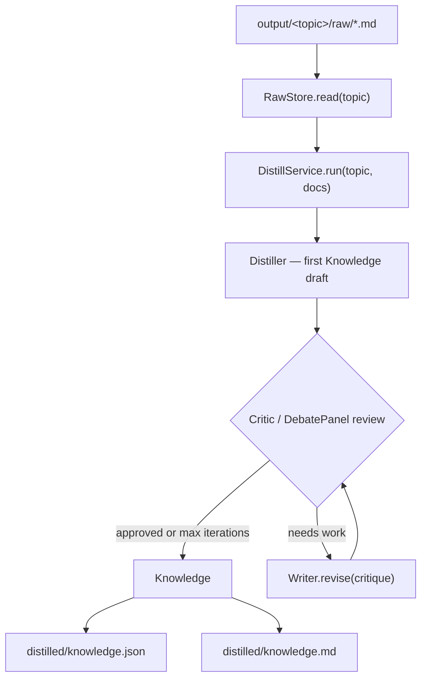

# Distill silo

Turns a topic's ingested `raw/` Markdown into one shared `Knowledge` object — the
render-agnostic core every renderer draws from. Distillation extracts reusable
*structure* (frameworks, mental models, decision criteria, techniques), not a
summary, then runs a critique loop until an editor approves it or the iteration
budget is spent.

Unlike [ingest](INGEST.md), distill **requires an LLM** (see
[Backends](#backends)). It reads what ingest already wrote, so you can iterate on
distillation without re-fetching sources.

## What it produces

One `Knowledge` object per run, persisted two ways under
`output/<topic-slug>/distilled/`:

| File | Purpose |
|---|---|
| `knowledge.json` | The structured `Knowledge` — the canonical distill output. |
| `knowledge.md` | The same content rendered as readable long-form Markdown. |

`Knowledge` fields: `title`, `summary`, `sections[]` (title, body, takeaways),
`frameworks[]` (name, summary, when_to_use), `key_terms[]` (name, definition),
`takeaways[]`, `provenance[]` (source origins), `metadata`.

## CLI

### `distill` — reload `raw/` → distil (no ingest/render)

```bash
agentic-blog distill --topic <slug> [OPTIONS]
```

| Option | Purpose |
|---|---|
| `--topic`, `-t` | Topic slug to distil; reads `output/<slug>/raw/` (required). |
| `--debate` | Use the debate panel (multiple personas) instead of a single critic. |
| `--config` | Config directory (default `config`). |
| `--verbose`, `-v` | Add DEBUG logs (per-silo INFO shows by default). |

Runs the distill step in isolation against whatever backend the `llm:` section
of `config/config.yaml` selects. Exits `2` if the topic has no `raw/` directory — run
[`ingest`](INGEST.md) first.

```bash
agentic-blog ingest  --topic tfm --manifest resources/tfm.txt   # once
agentic-blog distill --topic tfm                                # iterate freely
agentic-blog distill --topic tfm --debate                       # panel review
```

Prints the source count, score, iteration count, approval, title, and the paths
written.

### `run` — full pipeline (ingest → distil → render)

`run` ingests, distils, and renders in one pass. Use `distill` to test or re-run
distillation alone on already-ingested sources.

## Library

```python
from agentic_blog import Pipeline

pipe = Pipeline.from_config("config/")
result = pipe.distill(topic="tfm")          # optional: debate=True

result.knowledge      # the Knowledge object
result.score          # critic score (0–10)
result.iterations     # critique loop passes
result.approved       # score >= approval_threshold
result.output_paths   # [knowledge.json, knowledge.md]
```

## The critique loop

Critique happens **once**, here, on the shared `Knowledge` — never per rendered
artifact ([design contract](DESIGN.md) §14). The loop:

1. **Distil** — one deep pass assembles the source material (capped at a
   ~120K-char budget, split evenly across sources) and extracts the first
   `Knowledge` draft.
2. **Review** — a `Critic` scores fidelity, structural usefulness, specificity,
   and coverage (0–10) and approves at or above `pipeline.approval_threshold`.
   With `--debate`, a `DebatePanel` of personas (Practitioner, Skeptic, Educator)
   reviews instead.
3. **Revise** — if not approved, a `Writer` improves the draft against the
   critique. Repeat review/revise until approved or
   `pipeline.max_critique_iterations` is reached.

Relevant `pipeline:` knobs in `config/config.yaml`: `approval_threshold`
(default 7), `max_critique_iterations` (default 3).

## Backends

The distill silo talks to any OpenAI-compatible chat endpoint through a single
`LLMClient.complete()` seam. Every prompt asks for strict JSON, so the client
constrains the response to a JSON object (`response_format`) and retries on an
empty response — this keeps reasoning models that stream their thinking to a
separate channel from returning nothing usable.

Configure the backend in the `llm:` section of `config/config.yaml`:

| Backend | `base_url` | `model` | API key |
|---|---|---|---|
| Local Ollama | `http://localhost:11434/v1` | e.g. `gpt-oss:20b` | none (localhost) |
| OpenRouter | `https://openrouter.ai/api/v1` | e.g. `google/gemini-2.0-flash` | `LLM_API_KEY` |
| OpenAI | `https://api.openai.com/v1` | e.g. `gpt-4o` | `LLM_API_KEY` |

Local endpoints (`localhost`, `127.0.0.1`) need no key. Remote backends read
`LLM_API_KEY` from `.env`. Local models are slower on large context — raise
`timeout_seconds` (600 is a comfortable default for a 20B model).

Run distillation locally, end to end:

```bash
ollama pull gpt-oss:20b
# config/config.yaml -> llm: { base_url: http://localhost:11434/v1, model: gpt-oss:20b }
agentic-blog ingest  --topic tfm --manifest resources/tfm.txt
agentic-blog distill --topic tfm
```

## Flow


