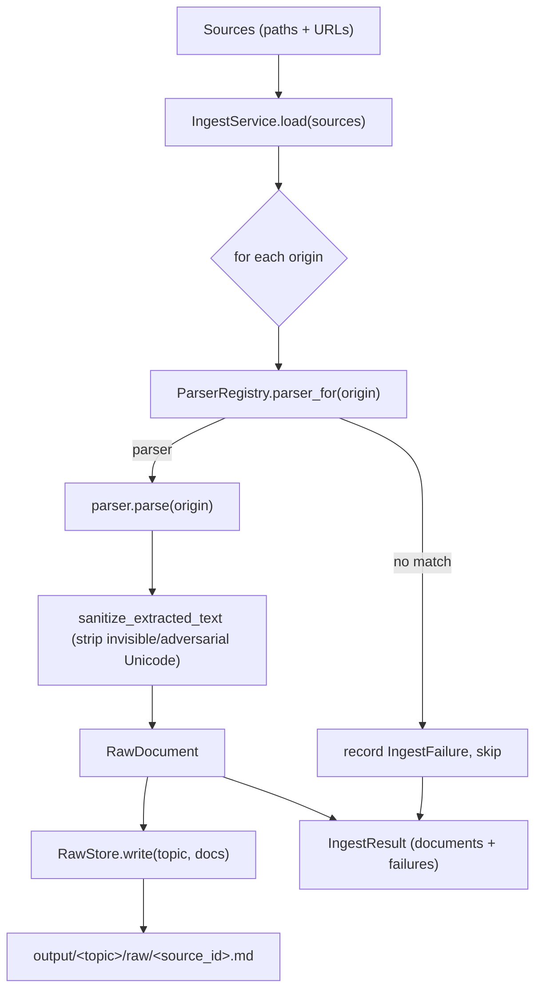

# Ingest silo

Turns a batch of sources (files or URLs) into clean `RawDocument` objects and
persists each as Markdown under `output/<topic-slug>/raw/`. The silo is
batch-tolerant: one bad source is recorded as a failure and skipped, never
aborting the run.

## Supported sources

Resolved by the first parser that accepts the origin (most-specific first).
PDF, web, GitHub, and `.md` sources extract to **Markdown**; the rest to plain text.

| Source | Matches | Extractor | Output |
|---|---|---|---|
| GitHub repo | `https://github.com/<owner>/<repo>` (opt. `/tree/<branch>`) | `git clone --depth=1` → Markdown digest | markdown |
| Web page | any other `http(s)://` URL | fetch + `markdownify` (fallback: text) | markdown |
| PDF | `.pdf` | `pymupdf4llm` (fallback: `pdftotext`/`pypdf`/`pdfminer`) | markdown |
| Word | `.docx` | `python-docx` | text |
| RTF | `.rtf` | `striprtf` | text |
| HTML file | `.html`, `.htm`, `.xhtml` | local HTML parse | text |
| Text | `.txt`, `.text`, `.md`, `.markdown`, `.rst`, `.adoc`, `.asciidoc` | read as-is (`.md`/`.markdown` → markdown) | text/markdown |

Run `agentic-blog check` to see which optional extractors are installed.

## CLI

### `ingest` — ingest → extract → persist raw (no distill/render, no LLM)

```bash
agentic-blog ingest --topic <slug> [PATHS...] [OPTIONS]
```

| Option | Purpose |
|---|---|
| `--topic`, `-t` | Topic slug for the `raw/` output (required). |
| `[PATHS...]` | Positional file paths or URLs to ingest. |
| `--url` | A URL to fetch/clone (repeatable). |
| `--source-dir` | Directory to recurse; keeps only files a parser accepts. |
| `--manifest` | File listing sources — one path, folder, or URL per line. |
| `--config` | Config directory (default `config`). |
| `--verbose`, `-v` | Add DEBUG logs (per-silo INFO shows by default). |

`--manifest` is the recommended way to curate a mixed source list. Each line is a
file, a folder (recursed for parseable files), or a URL; blank lines and `#`
comments are ignored, and relative paths resolve against the manifest's own
directory. URLs are fetched/cloned individually — unlike `--source-dir`, which
sees a `urls.txt` as a single text file rather than expanding its links.

Example manifest (`resources/tfm.txt`):

```text
# local documents
seldon-technical-report.pdf
papers/                       # a folder, recursed

# remote sources
https://github.com/owner/repo
https://example.com/post
```

Examples:

```bash
# A curated manifest of files, folders, and URLs
agentic-blog ingest --topic tfm --manifest resources/tfm.txt

# A whole folder of local documents
agentic-blog ingest --topic tfm --source-dir resources/tfm
```

Each source prints its `parser`, `format`, `mime`, char count, and raw path.

### `check` — report installed extractors

```bash
agentic-blog check
```

### `run` — full pipeline (ingest → distil → render)

`run` goes beyond ingest and requires an LLM. Use `ingest` to test extraction in
isolation.

## Output

Per source: `output/<topic-slug>/raw/<source_id>.md`, with YAML front matter
(`source_id`, `origin`, `mime`, `title`, `parser`, `format`, `ingested`)
followed by the extracted body.

## Flow


