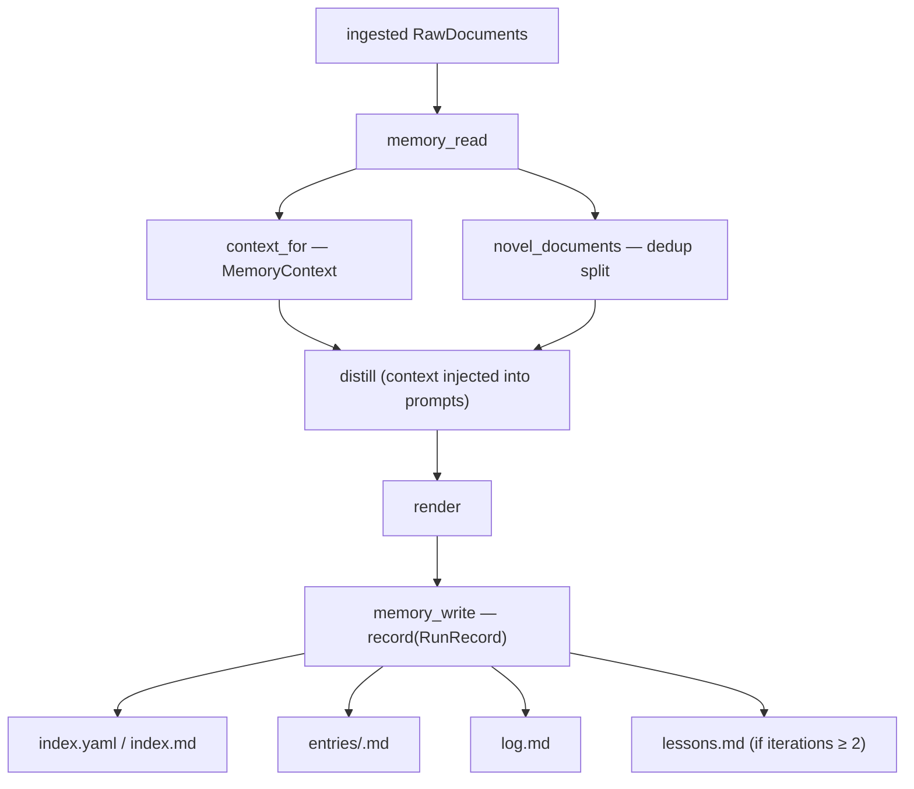

# Memory silo

Gives each topic an **editorial memory** so successive runs stay coherent: it
tracks which sources a topic has already ingested (dedup), feeds prior context
back into distillation to avoid repeating angles, and records every run as
human-readable Markdown. Memory is Markdown-first and pluggable — every other
silo depends only on the `MemoryStore` Protocol, never on a concrete backend.

Memory is **not** an LLM step and needs no network. It runs automatically as part
of [`run`](../README.md) — once before distillation (read) and once after render
(write). There is no standalone `memory` pipeline command; inspect what it wrote
with the `memory` CLI subcommands below.

## What it produces

One directory per topic under `output/<topic-slug>/`, alongside the `raw/`,
`distilled/`, and `artifacts/` the other silos write:

| File | Purpose |
|---|---|
| `index.yaml` | Canonical catalog of ingested sources; dedup key is `source_id`. Authoritative. |
| `index.md` | Human-readable table regenerated from `index.yaml` (do not edit by hand). |
| `entries/<slug>.md` | One page per source ingested (title, origin, added date, last score, keywords). |
| `lessons.md` | Weighted editorial lessons distilled from hard (multi-iteration) runs. |
| `log.md` | Append-only run log — one dated line per run. |

`index.yaml` is the source of truth; `index.md` is a view of it. No database.

## CLI

Memory is written by `run`; these subcommands read it back.

```bash
agentic-blog memory list             # topics recorded under output/
agentic-blog memory show <topic>     # print a topic's index.md
```

| Command | Purpose |
|---|---|
| `memory list` | List every topic dir that has an `index.yaml`, with its source count. |
| `memory show <topic>` | Print the topic's human-readable `index.md`. Exits `1` if none. |
| `--config` | Config file or directory (default `config`), to resolve `output_root`. |

## Library

Memory is used through the `Memory` façade inside a run; it is not exposed as a
`Pipeline` method. The façade wraps any `MemoryStore`:

```python
from agentic_blog.memory.wiki import Memory, build_store
from agentic_blog.settings import MemorySettings

store = build_store(MemorySettings(), root="output", today="2026-08-13")
mem = Memory(store)

ctx = mem.context_for("tfm", documents)          # MemoryContext to inject into distill
novel, seen = mem.novel_documents("tfm", documents)  # per-source dedup split
mem.record("tfm", title=..., documents=..., score=..., iterations=..., critique=...)
```

## How it works

Memory touches a run at two graph nodes: `memory_read` (before distill) and
`memory_write` (after render).

**Read — `context_for` + `novel_documents`:**

1. `already_ingested(topic, source_id)` splits the ingested docs into *novel* vs.
   *already-seen* for this topic (the dedup signal).
2. `context_for(topic, source_ids)` builds a `MemoryContext` — *related* prior
   entries (ranked by keyword overlap), *recent titles* within the novelty window,
   and the *top weighted lessons*. `MemoryContext.as_prompt_block()` renders it as
   three prompt sections injected into the distiller/writer:
   - `### Previously covered on this topic`
   - `### Recently written (differentiate the angle)`
   - `### Editorial lessons — apply without exception`

**Write — `record`:** after render, one `MemoryEntry` is upserted per source
(keyed by `source_id`), `index.yaml`/`index.md` are rewritten newest-first, and a
line is appended to `log.md`. Runs that needed ≥2 critique iterations also append
a **lesson** (the critique, capped at 300 chars).

**Lesson weighting:** a new lesson starts at weight `1.0`; each subsequent lesson
in the same topic decays the older ones by `0.85`, and lessons below `0.1` are
purged. `context_for` injects the top `max_lessons_injected` by weight — so recent
editorial feedback dominates and stale notes fade out.

## What memory does *not* do

Memory is an editorial-continuity and dedup layer, **not** a compute cache. It
does not short-circuit extraction or distillation: on a re-run with no new
sources, `already_ingested` marks everything as seen, but the graph deliberately
falls back to *all* documents so the run still produces artifacts — meaning
distillation re-runs. To avoid recomputation when inputs are unchanged, use the
split commands ([`ingest`](INGEST.md) → [`distill`](DISTILL.md) →
[`render`](RENDER.md)) that reload persisted intermediates instead of re-running
the full pipeline.

## Config

The `memory:` section of `config/config.yaml`:

| Knob | Default | Effect |
|---|---|---|
| `backend` | `markdown` | `markdown` (default) or `knowledge_base` (stub). |
| `novelty_window_days` | `14` | Window used to build the "recently written" list. |
| `max_lessons_injected` | `5` | Top-weighted lessons re-injected into the writer. |

## Backends

Selecting a backend is a one-line wiring change in `build_store`, because every
silo depends only on the `MemoryStore` Protocol and the shared value objects
(`MemoryEntry`, `MemoryContext`, `RunRecord`).

| Backend | Status |
|---|---|
| `markdown` | Default. Filesystem-backed, human-readable, no dependencies. |
| `knowledge_base` | Stub for a future vector/graph (RAG) backend — raises a clear error if selected. |

## Flow


