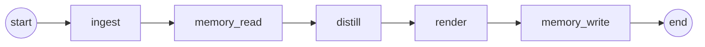

# Pipeline

How the four silos are wired into a single run. The pipeline is a thin
orchestration layer: a [LangGraph](https://github.com/langchain-ai/langgraph)
state machine drives `ingest → memory → distill → render → memory`, and the
`Pipeline` class is the public façade over it. All real work lives in the silos
([ingest](INGEST.md), [distill](DISTILL.md), [render](RENDER.md),
[memory](MEMORY.md)); the nodes here are thin adapters that move data between
them through the contracts in `agentic_blog/contracts.py`.

## The graph

A run is a linear state machine with one node per step. The critique loop is
**internal** to the distill node (critique happens once, on the shared
`Knowledge`), so the top-level graph stays linear:



| Node | Silo | Reads from state | Writes to state |
|---|---|---|---|
| `ingest` | ingest | `sources` | `documents`, `ingest_failures` (+ persists `raw/`) |
| `memory_read` | memory | `topic`, `documents` | `novel_documents`, `memory_context` |
| `distill` | distill | `novel_documents`, `memory_context` | `knowledge`, `score`, `iterations`, `approved`, `critique` |
| `render` | render | `knowledge`, `renders` | `artifacts` |
| `memory_write` | memory | `topic`, `knowledge`, `documents`, `score`, … | — (persists `index.yaml`, `entries/`, `log.md`, `lessons.md`) |

Wiring lives in `graph.py`: `build_graph(silos, checkpoint_path=…)` builds the
`StateGraph`, adds the five nodes, and connects them `START → ingest →
memory_read → distill → render → memory_write → END`. The nodes are closures
over a `Silos` dataclass (the four services + the raw store), injected at build
time.

### Node details

- **`ingest`** — `IngestService.load(sources)` resolves each origin to a parser,
  extracts and sanitizes text into `RawDocument`s, and records per-source
  failures. When a `raw_store` is present it also writes `output/<topic>/raw/`.
- **`memory_read`** — splits documents into novel vs. already-ingested
  (`novel_documents`) and builds a `MemoryContext` (`context_for`). If *nothing*
  is novel it falls back to all documents, so a re-run still produces artifacts.
- **`distill`** — runs the distil → critique → revise loop on the (novel)
  documents with the memory context injected into the prompts. See
  [DISTILL.md](DISTILL.md#the-critique-loop).
- **`render`** — fans the shared `Knowledge` out to every requested renderer
  (`renders`, defaulting to `render.kinds` from config). See [RENDER.md](RENDER.md).
- **`memory_write`** — records the run: one entry per source, plus the run log
  and (for hard runs) an editorial lesson. See [MEMORY.md](MEMORY.md).

## Pipeline state

State is a flat `TypedDict` (`state.py`) threaded through every node. It is kept
JSON-ish so the checkpointer can serialize it; rich value objects
(`RawDocument`, `Knowledge`, `Artifact`, `MemoryContext`) are carried as-is.

```python
class PipelineState(TypedDict, total=False):
    # inputs
    topic: str
    sources: list[str]
    renders: list[str]
    run_date: str
    # ingest
    documents: list[RawDocument]
    ingest_failures: list[str]
    # memory (read)
    memory_context: MemoryContext
    novel_documents: list[RawDocument]
    # distill
    knowledge: Knowledge
    score: float
    iterations: int
    approved: bool
    critique: str
    # render
    artifacts: list[Artifact]
```

Each node returns a partial dict that LangGraph merges into the running state, so
downstream nodes see everything accumulated so far.

## Checkpointing & resumability

When `langgraph-checkpoint-sqlite` is installed, `run` attaches a
`SqliteSaver` at `output/<topic-slug>/.checkpoints.sqlite`, keyed by
`thread_id = slugify(topic)`. An interrupted run can resume mid-graph from the
last completed node for the same topic. A serializer allow-list
(`_serde`) whitelists the contract value objects so LangGraph deserializes them
without warnings.

Two graceful fallbacks keep the pipeline dependency-light:

- **No LangGraph** — `build_graph` returns a `_LinearRunner` that calls the same
  five node functions in order, with an identical `invoke(state)` surface.
- **No SQLite checkpointer** — the graph compiles without one; runs still work,
  they just aren't resumable.

> Note: memory tracks provenance and novelty but is **not** a compute cache — a
> re-run with unchanged sources still re-distills. To avoid recomputation, use
> the split commands (below), which reload persisted intermediates.

## The `Pipeline` façade

`Pipeline` (`pipeline.py`) is the public library surface. Construct it from a
config directory, then call one of four methods:

```python
from agentic_blog import Pipeline

pipe = Pipeline.from_config("config/")
result = pipe.run(topic="observability", sources=["book.pdf"], renders=["blog", "skill"])
print(result.topic_dir)   # output/observability/
```

| Method | Runs | Reads | Writes | Result |
|---|---|---|---|---|
| `run(topic, sources, …)` | full graph | sources | `raw/`, `distilled/`, `artifacts/`, memory | `RunResult` |
| `ingest(topic, sources)` | ingest only | sources | `raw/` | `IngestRunResult` |
| `distill(topic, …)` | distill only | `raw/` | `distilled/` | `DistillRunResult` |
| `render(topic, renders=…)` | render only | `distilled/knowledge.json` | `artifacts/`, `log.md` | `RenderRunResult` |

`run` also accepts `debate` (override the config's debate panel) and `thread_id`
(override the checkpoint key). `render`/`run` default `renders` to the required
`render.kinds` config list when not passed.

### Full run vs. split commands

`run` executes every stage in one pass. The three standalone commands persist and
reload intermediate artifacts, which is the pipeline's recomputation-avoidance
mechanism — each stage reads what the previous one wrote:

```bash
agentic-blog ingest  --topic tfm --manifest resources/tfm.txt   # → raw/
agentic-blog distill --topic tfm                                # raw/ → distilled/ (LLM)
agentic-blog render  --topic tfm --render blog,skill            # distilled/ → artifacts/ (no LLM)
```

Distill is the only expensive stage (it needs an LLM); ingest and render need no
network. Re-run `render` alone to add formats, or `distill` alone to iterate on
extraction, without repeating the earlier stages.

## Output layout

One self-contained directory per topic under `output/<topic-slug>/`:

```
output/<topic-slug>/
  raw/                    # ingest — extracted source Markdown
  distilled/              # distill — knowledge.json + knowledge.md
  artifacts/              # render — <kind>/… + log.md
  index.yaml / index.md   # memory — source catalog
  entries/                # memory — one page per source
  lessons.md / log.md     # memory — editorial lessons + run log
  .checkpoints.sqlite     # resumable-run state (if enabled)
```

## Config

Every stage reads its tunables from `config/config.yaml` (one section per silo);
nothing is hard-coded. See each silo doc for its knobs:
[`pipeline`](DISTILL.md#the-critique-loop) & [`llm`](DISTILL.md#backends),
[`render`](RENDER.md), [`memory`](MEMORY.md#config), and `debate`.
