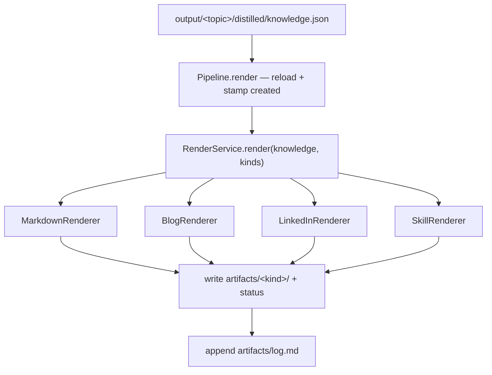

# Render silo

Turns one topic's distilled `Knowledge` into consumable **artifacts** — a Markdown
article, a blog post, a LinkedIn post, and an agent **skill** bundle. Every
renderer draws from the *same* `Knowledge`; they differ only in which fields they
read and how hard they compress ([design contract](DESIGN.md): "a skill is just a
renderer").

Unlike [distill](DISTILL.md), render **requires no LLM and no network**. It reloads
what distill already wrote (`distilled/knowledge.json`), so you can re-render a
topic into new formats freely without re-fetching or re-distilling.

## What it produces

Artifacts land under `output/<topic-slug>/artifacts/<kind>/`. Each renderer emits
its own file layout:

| Kind | Files | Shape |
|---|---|---|
| `markdown` | `<slug>.md` | Full long-form prose (low compression). |
| `blog` | `<slug>.md` | Narrative post with SEO front-matter, budgeted to `target_words`. |
| `linkedin` | `<slug>-linkedin.md` | Hook + 3 points + hashtags (high compression). |
| `skill` | `SKILL.md`, `chapters/NN-<slug>.md`, `glossary.md`, `cheatsheet.md` | Progressive-disclosure bundle: a lean `SKILL.md` index plus on-demand chapters. |

A run also appends to `output/<topic-slug>/artifacts/log.md` — an idempotent,
dated record of what was rendered (see [Provenance & log](#provenance-idempotency--log)).

## CLI

### `render` — reload distilled knowledge → artifacts (no ingest/distill)

```bash
agentic-blog render --topic <slug> [OPTIONS]
```

| Option | Purpose |
|---|---|
| `--topic`, `-t` | Topic slug to render; reads `output/<slug>/distilled/knowledge.json` (required). |
| `--render`, `-r` | Comma-separated renderers: `markdown`, `blog`, `linkedin`, `skill`. Omit to use `render.kinds` from config. |
| `--config` | Config directory (default `config`). |
| `--verbose`, `-v` | Add DEBUG logs (per-silo INFO shows by default). |

Exits `2` if the topic has no `distilled/knowledge.json` (run [`distill`](DISTILL.md)
first) or if an unknown renderer is requested.

```bash
agentic-blog ingest  --topic tfm --manifest resources/tfm.txt   # once
agentic-blog distill --topic tfm                                # once
agentic-blog render  --topic tfm --render markdown,blog,skill   # render freely
agentic-blog render  --topic tfm --render linkedin              # add a format later
```

Prints the topic, output dir, renderers, source count, and each artifact with its
write status — `created`, `updated`, or `unchanged` — plus the log path.

### `run` — full pipeline (ingest → distil → render)

`run` ingests, distils, and renders in one pass. Use `render` to add or refresh
formats for a topic that is already distilled, without touching the LLM.

## Library

```python
from agentic_blog import Pipeline

pipe = Pipeline.from_config("config/")
result = pipe.render(topic="tfm", renders=["blog", "skill"])

result.artifacts      # {kind: Artifact} — each Artifact is a {relpath: content} bundle
result.statuses       # [(Path, "created" | "updated" | "unchanged"), ...]
result.sources        # provenance carried from the distilled Knowledge
result.log_path       # output/tfm/artifacts/log.md
```

## How renderers work

Adding a format is registering a renderer in `render/registry.py` (Open/Closed) —
the pipeline never changes. Each renderer is constructed with its `RenderPolicy`
from `the `render:` section of config/config.yaml`, so length and compression are data, not code:

The `render:` section also has a required `kinds:` list — the renderers `run`
and `render` produce when no `--render` flag is given (e.g. `kinds: [markdown,
blog, skill]`).

| Kind | Policy knobs (in `the `render:` section of config/config.yaml`) |
|---|---|
| `markdown` | `compression` (conceptual — full prose). |
| `blog` | `target_words` (prose budget), `seo` (emit a `keywords:` line). |
| `linkedin` | `hashtags` (tag count, from key terms). |
| `skill` | `skill_md_max_tokens` (cap on `SKILL.md`), `chapter_budget_tokens` (per-chapter body cap). |

The skill token budgets trim the assembled `SKILL.md` and each chapter body to fit
their caps, keeping the index cheap for an agent to load before it pulls chapters
on demand.

## Provenance, idempotency & log

Every rendered artifact — except LinkedIn, which stays front-matter-free so the
post is paste-able — carries provenance in YAML front-matter:

```yaml
---
created: 2026-08-13          # ISO date of the render
sources:                     # the distilled Knowledge's provenance
  - https://example.com/post
  - /path/to/report.pdf
---
```

Renders are **idempotent and transparent**: a file is always (re)written, but each
one is classified as `created` (new), `updated` (content differed), or `unchanged`
(byte-identical), and every run appends a dated entry to `artifacts/log.md`:

```markdown
## [2026-08-13] render | tfm | markdown, blog, skill
- renders: markdown, blog, skill
- sources: 6 — https://…, /path/to/report.pdf, …
- artifacts:
  - artifacts/markdown/<slug>.md (created)
  - artifacts/blog/<slug>.md (updated)
  - artifacts/skill/SKILL.md (unchanged)
```

## Flow


